**SENG 438 - Software Testing, Reliability, and Quality**

**Lab. Report #3 – Code Coverage, Adequacy Criteria and Test Case Correlation**

| Group \#:      |  22   |
| -------------- | --- |
| Student Names: |     |
|       Suyoung         |     |
|         Joseph       |     |
|         Joan       |     |
|         Raghav       |     |

(Note that some labs require individual reports while others require one report
for each group. Please see each lab document for details.)

# 1 Introduction

This lab report focuses on unit testing using JUnit in Eclipse, with an emphasis on white-box testing and code coverage analysis. We used EclEmma to measure statement, branch, and condition coverage for our test suite on JFreeChart, specifically the DataUtilities and Range classes. The goal was to evaluate test adequacy, improve coverage by designing new test cases, and manually analyze data-flow coverage for specific methods. This report outlines our approach, the challenges faced, and the effectiveness of EclEmma in assessing and enhancing our test suite.

# 2 Manual data-flow coverage calculations for calculateColumnTotal and combine methods

### combine(Range range1, Range range2) ###
- the data flow graph
 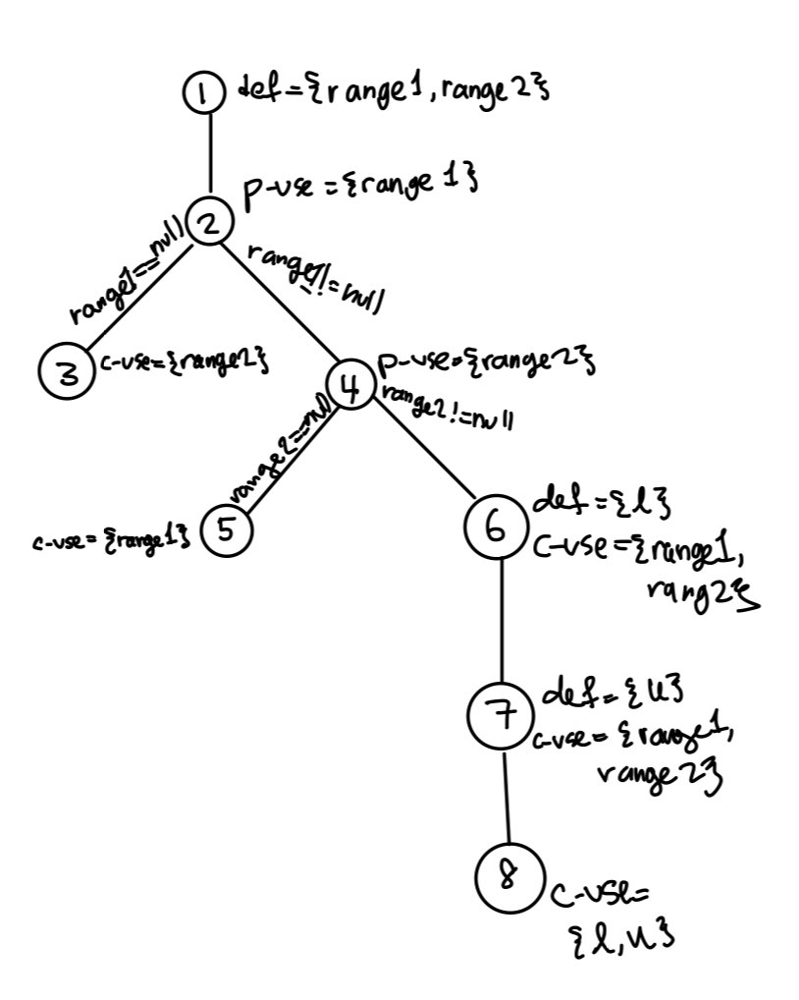

- the def-use sets per statement
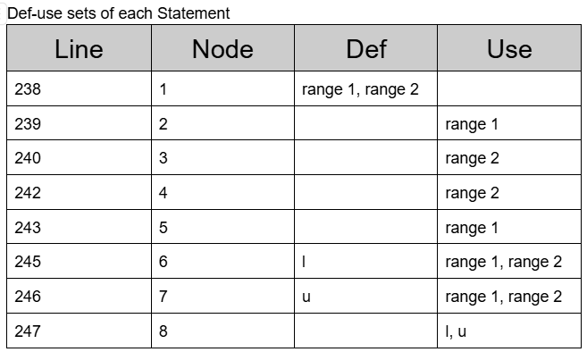

- list all DU-pairs per variable
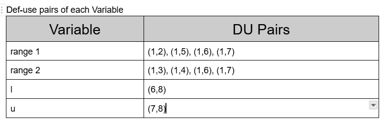
- for each test case show which pairs are covered
- calculate the DU-Pair coverage.
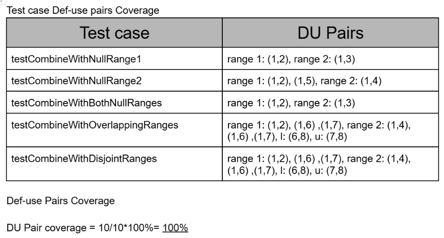
### calculateColumnTotal(Values2D data, int column) ###
- the data flow graph
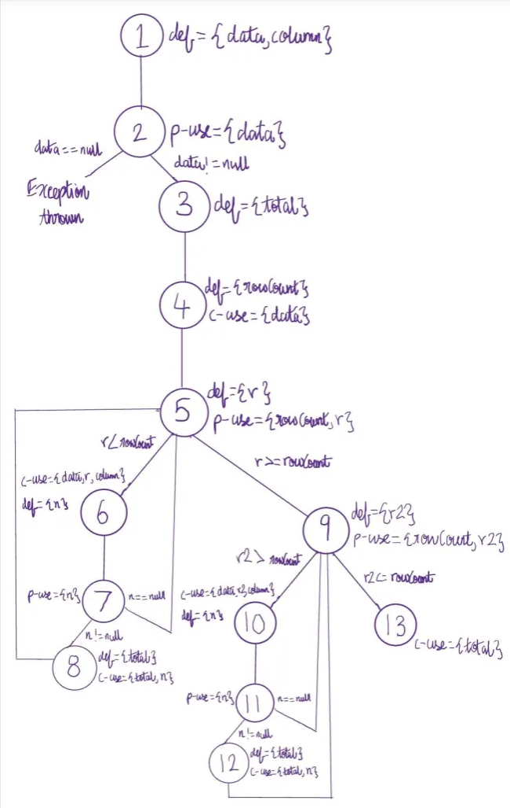
- the def-use sets per statement
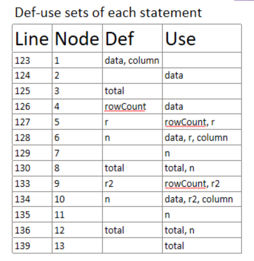
- list all DU-pairs per variable
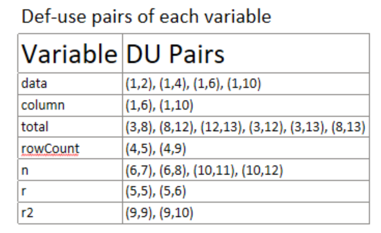

- for each test case show which pairs are covered
- calculate the DU-Pair coverage.
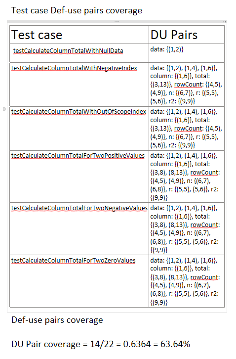 

# 3 A detailed description of the testing strategy for the new unit tests

// As with any testing to be done, to begin with, a plan must be created. Document this test plan, as it will be included 
//with your lab report. This plan should include information about who will create which tests, how you plan to develop 
//tests to achieve the adequacy criteria.

#### 1. **Test Plan Overview**
The goal of this testing strategy is to ensure that the new unit tests for the `DataUtilities` and `Range` classes are comprehensive, well-organized, and achieve the desired adequacy criteria. The tests will cover various scenarios, including edge cases, invalid inputs, and typical use cases, to ensure robustness and reliability.

#### 2. **Test Development Responsibilities**
The development of the new unit tests will be evenly distributed among the team members: Raghav, Joseph, Bella, and Joan. Each member will be responsible for creating and documenting specific test cases, as outlined below.

---

### **Test Development Assignments**

#### **Raghav**
- **DataUtilities:**
  - `testGetCumulativePercentagesForANullValue`
  - `testCalculateRowTotalWithNegativeColumn`
  - `testCalculateColumnTotalWithNullDataAndValidRows`
  - `testCalculateColumnTotalWithEmptyValidRows`
  - `testCalculateColumnTotalWithValidRows`
  - `testCalculateColumnTotalWithOutOfBoundsRows`
  - `testCalculateColumnTotalWithZeroRows`

- **Range:**
  - `getLengthWithBothBoundsNegative`
  - `getLengthWithBothBoundsPositive`
  - `getLengthWithBothBoundsEqual`
  - `getLengthWithNegativeLowerAndPositiveUpper`
  - `getLengthWithZeroLowerAndPositiveUpper`
  - `getLengthWithNegativeLowerAndZeroUpper`
  - `getLengthWithInvalidRange`

---

#### **Joseph**
- **DataUtilities:**
  - `testBothArraysNull`
  - `testOneArrayNulla`
  - `testOneArrayNullb`
  - `testDifferentArrayLengths`
  - `testNestedArrayInequality`
  - `testNestedArrayEquality`

- **Range:**
  - `testGetCentralValue`
  - `testConstrainWithinRange`
  - `testConstrainAboveUpperBound`
  - `testConstrainBelowLowerBound`
  - `testIntersectsLowerBoundaryTrue`
  - `testIntersectsLowerBoundaryFalse`
  - `testIntersectsWithinRangeTrue`
  - `testIntersectsOutsideRangeFalse`
  - `testIntersectsRange`

---

#### **Bella**
- **DataUtilities:**
  - `testClone_NullSource`
  - `testClone_EmptyArray`
  - `testClone_NonNullRows`
  - `testClone_WithNullRows`
  - `testClone_JaggedArray`
  - `testCalculateRowTotalWithEmptyValidCols`
  - `testCalculateRowTotalWithValidCols`
  - `testCalculateRowTotalWithNullValues`
  - `testCalculateRowTotalWithOutOfBoundsCols`
  - `testCalculateRowTotalWithZeroColumns`

- **Range:**
  - `testHashCodeWithDistinctBounds`
  - `testHashCodeWithEqualBounds`
  - `testEqualsWithNonRangeObject`
  - `testEqualsWithDifferentLowerBound`
  - `testEqualsWithDifferentUpperBound`
  - `testEqualsWithEqualRanges`
  - `testGetLength_WithReflectionForFullCoverage`

---

#### **Joan**
- **Range:**
  - `combineIgnoringNaN_bothRangesNull`
  - `combineIgnoringNaN_firstRangeNullSecondNaN`
  - `combineIgnoringNaN_firstRangeNullSecondValid`
  - `combineIgnoringNaN_secondRangeNullFirstNaN`
  - `combineIgnoringNaN_secondRangeNullFirstValid`
  - `combineIgnoringNaN_bothRangesValid`
  - `combineIgnoringNaN_bothRangesNaN`
  - `combineIgnoringNaN_firstRangeNaNLowerBoundSecondValid`
  - `combineIgnoringNaN_firstRangeNaNUpperBoundSecondValid`
  - `expand_validRangeNoMargins`
  - `expand_validRangePositiveMargins`
  - `expand_validRangeNegativeMargins`
  - `expand_validRangeMixedMargins`
  - `expand_rangeCollapsesLowerGreaterThanUpper`
  - `expand_nullRangeThrowsException`
  - `expandToInclude_nullRange`
  - `expandToInclude_valueLessThanLowerBound`
  - `expandToInclude_valueGreaterThanUpperBound`
  - `expandToInclude_valueWithinRange`
  - `maxtest`
  - `mintest`
  - `scale_nullBaseThrowsException`
  - `scale_negativeFactorThrowsException`
  - `scale_zeroFactorReturnsZeroRange`
  - `scale_positiveFactorReturnsScaledRange`
  - `shift_validRangeShiftsCorrectly`
  - `shift_allowZeroCrossingTrue_shiftsRange`
  - `shift_allowZeroCrossingTrue_negativeShift`
  - `shift_allowZeroCrossingTrue_zeroShift`

---

### **Adequacy Criteria**
The test cases will be developed to meet the following adequacy criteria:
1. **Statement Coverage:** Ensure every line of code in the DataUtilities and Range classes is executed at least once.
2. **Branch Coverage:** Ensure all possible decision branches are tested.
3. **Boundary Value Analysis:** Test edge cases, such as minimum and maximum values, null inputs, and invalid ranges.
4. **Error Handling:** Verify that exceptions are thrown for invalid inputs and edge cases.
5. **Robustness:** Test for unexpected inputs, such as null values, empty arrays, and invalid ranges.

---

### **Test Development Process**
1. **Test Case Design:**
   - Each team member will design test cases based on their assigned responsibilities.
   - Test cases will include input data, expected results, and assertions.

2. **Test Implementation:**
   - Write JUnit test methods for each test case.
   - Use mocking frameworks (e.g., JMock) where necessary to simulate dependencies.

3. **Test Execution:**
   - Run the tests locally to ensure they pass.
   - Verify that the tests achieve the desired coverage and adequacy criteria.

# 4 A high level description of five selected test cases you have designed using coverage information, and how they have increased code coverage

//pick 5 test cases that we made newly to answer

expand_rangeCollapsesLowerGreaterThanUpper 
 

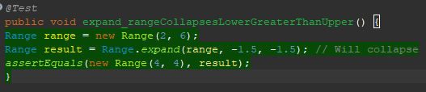 

- Purpose: Ensures that when both margins are negative enough to collapse the range, the method correctly sets both bounds to the same value.  
- Coverage Improvement: Covers the expand method’s behavior when it results in a collapsed range, ensuring it properly handles cases where the lower bound becomes greater than the upper bound.  

expand_nullRangeThrowsException 

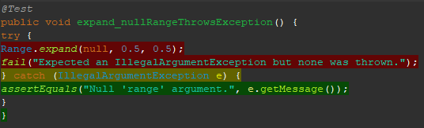 

- Purpose: Verifies that attempting to expand a null range throws the expected IllegalArgumentException.  
- Coverage Improvement: Ensures the expand method properly validates input and prevents operations on a null range.  

expandToInclude_nullRange 

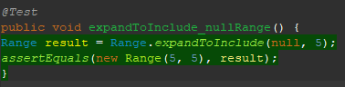 

- Purpose: Ensures that when expanding a null range, the method correctly creates a new range with both bounds set to the given value.  
- Coverage Improvement: Covers edge cases in expandToInclude, ensuring correct behavior when the initial range is null.  

scale_negativeFactorThrowsException 

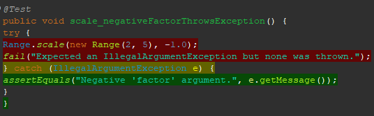 

- Purpose: Verifies that attempting to scale a range with a negative factor throws the expected IllegalArgumentException.  
- Coverage Improvement: Ensures input validation in the scale method, preventing incorrect transformations caused by negative scaling factors.  

shift_validRangeShiftsCorrectly 

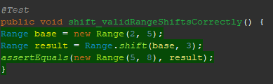 

- Purpose: Verifies that shifting a range by a positive value correctly translates both bounds.  
- Coverage Improvement: Covers the shift method in its simplest form, ensuring that adding a delta correctly moves the range without any additional constraints.  

# 5 A detailed report of the coverage achieved of each class and method (a screen shot from the code cover results in green and red color would suffice)

First for Range:  
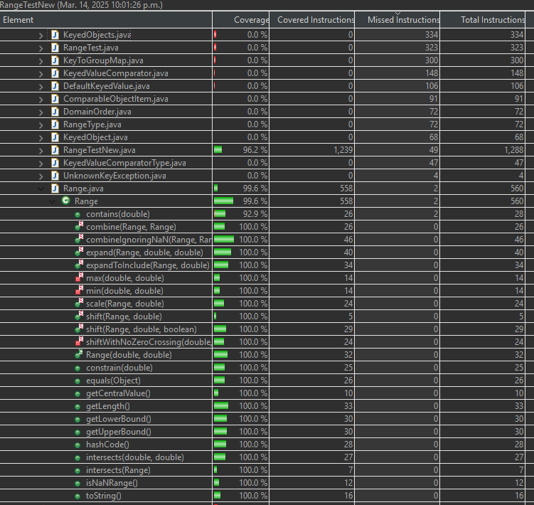  

Secondly for DataUtilities:  
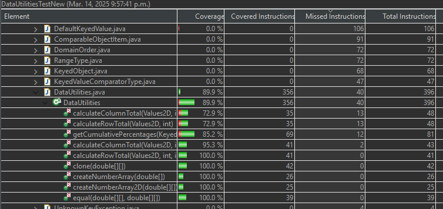  
//**explain why we can't reach 90% statement coverage for data utilities**

The reasons why DataUtilities can not have a 90% statement coverage is because of the following 4 code segments:

Firstly, we can see that the double total gets defined as 0.0 and is followed by a check to see if its above 0, meaning that the code to set it to a 100 is never run because the if statement is always false.  
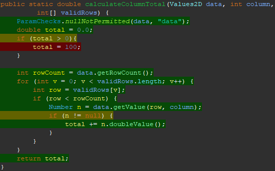

For the following three code segments, neither or the statements can have coverage because of the for loops checking if the return of itemCount(), rowCount(), and columnCount() are ever less than 0, which isn't possible.  

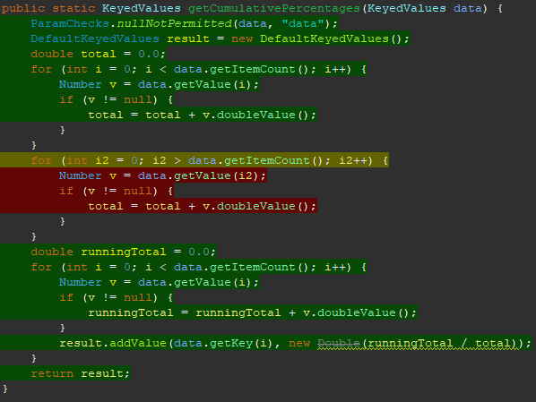
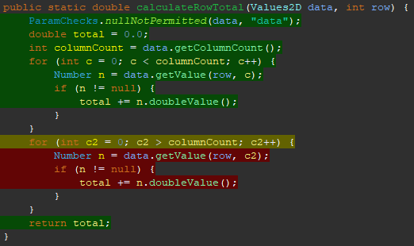
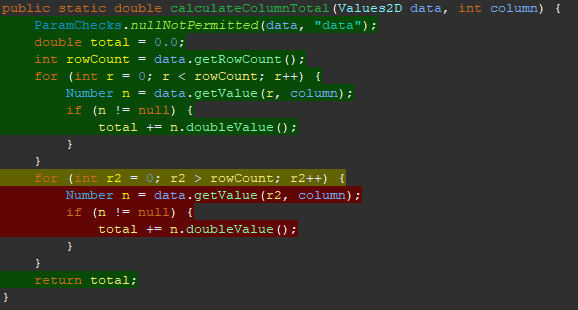
 
These four code segments account for all missing statement coverage that would have been required for a 100% covered.

# 6 Pros and Cons of coverage tools used and Metrics you report

//Pros and cons of the coverage tools tried by your group in this assignment, in terms of reported measures, 
//integration with the IDE and other plug-ins, user friendliness, crashes, etc.

For this assignment, we used EclEmma as our code coverage tool. One of its main advantages was its easy integration with Eclipse, requiring no additional plugins or setup beyond installation. It provided clear visual feedback on coverage metrics, including statement, branch, and condition coverage, making it easy to identify untested parts of the code. Additionally, we did not experience any crashes or compatibility issues. However, the main drawback was that it took us some time to fully understand how to use it effectively, especially in terms of configuring test runs and interpreting the coverage results. Once we got the hang of it, though, it proved to be a reliable and user-friendly tool for our testing needs.

# 7 A comparison on the advantages and disadvantages of requirements-based test generation and coverage-based test generation.

Requirements-based testing focuses on testing functionality based on system requirements, ensuring that the software behaves as expected for specified inputs and use cases. Its main advantage is that it verifies whether the software meets user and business needs. However it does not guarantee that all parts of the code are run.  

Coverage-based testing, on the other hand, ensures that a certain percentage of the code is executed, helping to identify untested areas and improve testing. This method is useful for finding hidden bugs in untested code paths but can lead to tests that execute code without meaningful behavior. 

In practice, a combination of both approaches provides the best balance between functional correctness and test coverage.

# 8 A discussion on how the team work/effort was divided and managed

When it came to teamwork and effort, everyone contributed equally, with each person taking on 25% of the assignment.

# 9 Any difficulties encountered, challenges overcome, and lessons learned from performing the lab

During the lab, we faced some challenges with setting up and using the code coverage tools, particularly with EclEmma. Manually calculating data flow coverage was tricky, as it required tracing the code’s data flow carefully. Designing new test cases to meet the required coverage targets was also a challenge, especially to cover all conditions properly. Working in a group helped, but required good communication and reviewing each other’s work to fix any issues. Overall, the lab taught us a lot about using coverage tools, designing thorough test cases, and working together effectively.

# 10 Comments/feedback on the lab itself

The lab was a great way to practice white-box testing and using code coverage tools, although setting up the tools and calculating data flow coverage was challenging. More examples on working with coverage tools would be helpful, but overall, it was a valuable learning experience.
